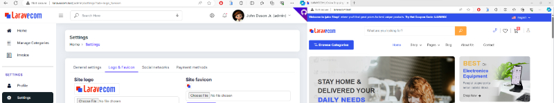

<p align="center">
<a href="https://laravel.com" target="_blank"></a></p>


# Build Laravel 10 Multi-Vendor eCommerce

You'll learn how to build your own e-commerce web application using the most powerful and user-friendly php framework available to web developers, Laravel.
By the end of the course, you will also be able to build and add powerful features to your web Laravel e-commerce including PayPal Payment System or Stripe Payment Gateway.


## Get Started

After download Laravel 10 Multi Vendor e-commerce project draft, you can follow the following steps for better start up.

`1.` Extract the zip file and put (laravecom) folder in your desired place ( xampp > htdocs) recommended. 
   Then open that folder in your favorite text editor. ( Visual Studio Code -> recommended )
   And run "php artisan optimize:clear" and "composer update" commands

`2.` Create new database in phpMyAdmin rename to (laravecom_db) and import tables using a given laravecom_db.sql file from downloaded root folder.

```sql
  DB_CONNECTION=mysql
  DB_HOST=127.0.0.1
  DB_PORT=3306
  DB_DATABASE=laravecom_db
  DB_USERNAME=root
  DB_PASSWORD=
```

`3.` Update .env file on mail configuration variables with your own mailtrap credentials:
```sql
  EMAIL_HOST='sandbox.smtp.mailtrap.io'
  EMAIL_USERNAME='yourMailTrapUsername'
  EMAIL_PASSWORD='yourMailTrapPassword'
  EMAIL_ENCRYPTION='TLS'
  EMAIL_PORT=587
  EMAIL_FROM_ADDRESS='info@laravecom.test'
  EMAIL_FROM_NAME='Laravecom'
  ```

`4.` Create virtual host (if you want to)
   
  Open notepad as administrator and open file in "C:\xampp\apache\conf\extra\httpd-vhosts.conf" 
  path and define your own virtual host:
```bash
    <VirtualHost *:80>
        DocumentRoot "C:/xampp/htdocs/laravecom/public"
        ServerName laravecom.test
    </VirtualHost>
```

  Also open "C:\Windows\System32\drivers\etc\hosts" to add a host

  127.0.0.1           laravecom.test

`5.` run "composer dump-autoload" command

`6.` If you did not make a virtual host, just run "php artisan serve" command
   to run project. Otherwise use "http://laravecom.test/" url in browser to run a project

`7.` Users credentials

  **ADMIN**
   - Username: admin
   - Email: admin@email.com
   - Password: 12345

  **SELLER**
   - Username: seller2
   - Email: seller2@gmail.com
   - Password: 12345

`8.` URLS

 * HOME Url: http://laravecom.test/

 * ADMIN Login Url: http://laravecom.test/admin/login

 * SELLER LOGIN Url: http://laravecom.test/seller/login 

`9.` Enjoy your coding....
